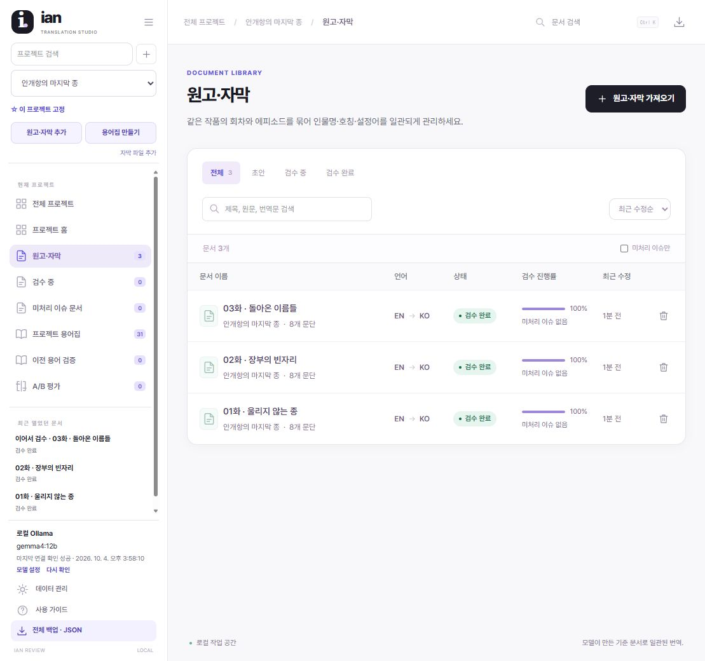

# 실제 소설 원고 워크플로 테스트 — 2026-10-04

새 프로젝트 **안개항의 마지막 종**을 만들고, 사건과 단서가 이어지는 창작 미스터리 판타지 3회차를 영어 → 한국어로 처리했다. 회차마다 8문단, 총 24문단이다. 실종된 아버지의 목소리를 따라간 수리공 나라가, 도시의 안전과 잊힌 이름 사이의 거래를 발견하는 이야기다.

## 수행 결과

- 실제 앱 UI로 프로젝트·모델 설정·원고를 등록했다. 다른 프로젝트는 수정하지 않았다.
- Ollama가 원문 전체에서 용어를 생성하고 재검증했다. 최종 기준은 31개다.
- 처음에는 `qwen2.5:14b`, 이후에는 `gemma4:12b`를 사용했다. 최종 프로젝트 모델은 `gemma4:12b`다.
- 3회차 24문단 모두 실제 Ollama 번역과 재검증을 거쳤다.
- **Ollama 결과를 그대로 완료 처리하지 않았다.** Codex가 원문·모델 용어집과 대조해 24문단을 추가 교정하고 앱에 저장했다. 이름과 호칭의 기준 번역은 유지했다.
- 세 문서를 검수 완료로 전환했다. 각 문서 8/8문단, 규칙 이슈 0개다.
- 세 문서를 각각 새로고침한 뒤 UI에서 원문과 최종 번역을 다시 읽어 24/24문단의 저장 일치를 확인했다.

## 발견 및 수정

### 용어집의 잘못된 근거가 자동 복구되지 않음

첫 실행은 원문과 맞지 않는 인용·구간 근거 때문에 저장 전에 멈췄다. 번역과 달리 용어집 추출·검증에는 응답 수정 절차가 없었다.

`projectGlossary.ts`의 양 단계에 최대 두 번의 모델 수정 요청을 추가했다. 실패한 용어·인용문을 알려주고, 정확한 인용문이 한 구간에서만 발견되면 그 문서·구간 ID를 알려준다. 모델이 수정한 결과도 원래의 엄격한 근거 검사를 통과해야 한다. 잘못된 ID를 앱이 임의로 받아들이지 않는다. 중단·계속 실패 시 미검증 결과를 저장하지 않는다.

### 4k 문맥에서 원문이 버려짐

Ollama 서버 로그에서 `n_ctx_slot = 4096`, `slot context shift`, `truncated = 1`을 관찰했다. 초기 근거 오류 자체는 문맥이 차기 전에도 발생했다. 문맥 확장만으로 모든 근거 오류가 해결된다는 뜻은 아니다.

앱 요청에 `num_ctx: 16384`를 지정했다. 이후 `/api/ps`에서 16,384 문맥 할당을 확인했다. 요청별 문맥 설정은 [Ollama Modelfile 설명](https://docs.ollama.com/modelfile), 메모리 영향은 [Ollama 문맥 길이 안내](https://docs.ollama.com/context-length)를 참조했다.

### 추론 모델이 결과 반환 전에 긴 내부 추론을 이어감

`gemma4:12b`의 용어 요청이 결과 저장 없이 수천 토큰을 계속 생성하는 것을 관찰하고 중지했다. `/api/show`의 `thinking` 지원을 확인한 모델에는 `think: false`를 전달하도록 했다. 비지원 모델에는 해당 필드를 보내지 않는다. 번역 결과의 별도 재검증은 계속 수행한다. API는 [Ollama chat 문서](https://docs.ollama.com/api/chat)에 근거했다.

### 정상 한글 수량에 숫자 경고 발생

`three times → 세 번`을 숫자 누락으로 표시했다. `twice → 두 번`도 기존 검사에서 비교하지 못했다. 명시적 수량 단위가 붙은 한국어 고유 수사와 영어 `twice`를 비교하도록 했다. 중복 수량과 실제 수량 차이는 경고하고, `세 번째`, `네모`, `세관`, `네 명령`, `열대` 같은 서수·일반 단어는 수량으로 만들지 않는 회귀 사례를 추가했다.

수량 검사는 모든 언어·수사·단위 환산을 해석하는 의미 검증기가 아니다. 특히 모호한 단독 one/한은 보수적으로 처리한다.

### 모델 생성 용어·번역의 의미 오류

`Ferryman → 도깨비 선인`은 원문에 없는 존재를 추가한 오류였다. 해당 항목만 UI에서 제거하고, 의미 검증 지시를 보강한 다른 설치 모델로 재생성했다. 모델이 정한 최종 기준은 `페리맨`이다. 사람이 기준 번역을 선택하는 대기열을 거치지 않았다.

번역에서도 다음 오류를 발견해 Codex가 추가 교정했다.

| 원문 의미 | Ollama 결과의 문제 | 최종 교정 |
|---|---|---|
| 준이 떠나기 전에 나라가 목도리를 둘러줌 | 나라가 떠나기 전으로 주체 변경 | 준이 떠나기 전으로 복원 |
| dry streets | 마르지 않는 거리 | 마른 거리 |
| 준은 나라에게 존댓말 | 2화에서 반말로 변경 | 회차 전체에서 존댓말 유지 |
| storms frightened her | 폭풍이 두려워하는 것으로 주체 변경 | 폭풍이 나라를 겁먹게 함 |
| 코트를 걸린 곳에서 내려 들었다가 되돌려 놓음 | 코트를 벗었다가 다시 입는 행동으로 변경 | 내려 들었다가 다시 걸음 |
| 잃었던 자장가 마지막 구절까지 기억이 돌아옴 | 마지막 구절이 빠진 자장가 | 마지막 구절까지 갖춘 자장가 |

`그자`, `멈기지요`, `돌려묻을` 같은 오탈자, 불필요한 닫는 따옴표, 소유·단서 누락도 교정했다. 생성·검증의 공통 지시에는 행동 주체·부정·시간·불확실성·조사·오탈자 확인을 추가했다. 이 지시가 이후 모든 의미 오류를 방지한다고 검증된 것은 아니다.

창작 영어 초안에도 열쇠 총수 오류가 있었으므로, 번역 전에 1화를 수정해 다시 등록했다. 원래 초안은 `source-draft-v1.json`에 보존했다. 최종 등록 원고는 `source.json`이며, 최종 원문 보존 비교는 이 파일을 기준으로 했다.

## 검증

- 단위 테스트 **191/191 통과**
- 브라우저 회귀 테스트 **7/7 통과** — 이 테스트의 모델 응답은 테스트 대역이다.
- lint 경고 0, 타입 검사·프로덕션 빌드 통과
- 실제 모델 실행은 위 3회차 UI 작업으로 별도 검증했다.
- 최종 브라우저 오류 로그 없음
- 규칙 이슈 0개만으로 문학적 품질을 인증하지 않는다. 실제로 3화의 Ollama 결과는 규칙 이슈가 없었지만 행동·단서 오류가 있었다.

## 결과 파일

GitHub에서 읽을 수 있는 원고·교정문·용어집·비교 자료는 [소설 예제](../examples/novel-harbor/README.md)에 함께 보관했다. 완료 화면은 아래와 같다.

`output/playwright/novel-harbor/`:

- `novel-ko.md`, `novel-ko.txt`: 앱에서 다시 읽은 최종 교정 소설
- `original-novel.md`, `source.json`: 최종 영어 원고
- `model-glossary.md`, `live-glossary.json`: UI에서 읽은 모델 기준 용어
- `ollama-before-postedit.json`: 실제 Ollama 결과를 보존한 교정 전 자료
- `final-documents.json`: 새로고침 후 UI에서 읽은 최종 원문·번역
- `documents-complete.jpg`: 세 문서의 검수 완료 화면
- `unit-test.log`, `browser-test.log`: 회귀 결과

위 읽기용 파일은 UI에서 관찰한 저장 결과를 로컬 파일로 작성한 것이다. 인앱 브라우저 다운로드 성공이나 전체 IndexedDB JSON 백업을 주장하지 않는다.
